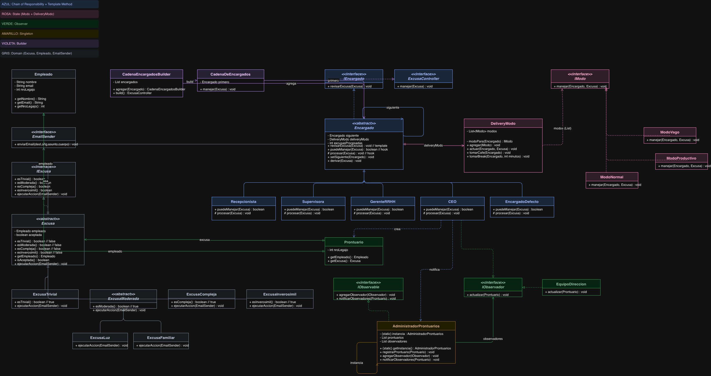

# TP Patrones de Diseño - Excusas S.A.

Hola profe. Este es mi trabajo para la materia. El sistema automatiza cómo se manejan las excusas cuando los empleados llegan tarde.

## 🛠 Arquitectura y Patrones de Diseño



## Cómo funciona el código:

Para que el código sea limpio y no repetir lógica, usé estos patrones:

1. **Cadena de Responsabilidad**: Las excusas pasan de un responsable a otro (Recepcionista -> Supervisora -> CEO). Si uno no puede o no le corresponde, se la pasa al siguiente.
2. **Estado (State) + Delivery**: Los jefes cambian su humor según cuántas excusas procesaron. Hay tres estados: Productivo (menos de 5), Normal (5 a 10) y Vago (11 o más). Esto lo maneja la clase `DeliveryModo` dinámicamente.
3. **Método Plantilla (Template Method)**: En la clase base `Encargado` puse la lógica general de cómo revisar una excusa (`revisarExcusa()`) para no repetir el control en cada jefe.
4. **Builder**: Lo usé para armar la cadena de jefes de forma fácil y configurable en el main.
5. **Observer**: Cuando el CEO acepta una excusa inverosímil, se crea un prontuario y se avisa automáticamente al equipo de dirección y al mismo CEO.
6. **Singleton**: Para garantizar que haya una sola instancia del `AdministradorProntuarios` en todo el sistema.

## Notas adicionales:
- En lugar de usar un simple `String` para el tipo de excusa, armé una jerarquía de clases (`ExcusaTrivial`, `ExcusaModerada`, etc.) para aprovechar el polimorfismo.
- Implementé los mensajes específicos de los emails para la Recepcionista, Supervisora (con el chequeo de EDESUR) y el CEO como pedía el enunciado.

## Cómo probarlo:
Para compilar y ver el sistema funcionando en la consola:
```bash
javac -d target $(find src/main/java/com/empresa -name "*.java")
java -cp target com.empresa.Demo
```

Para correr los tests de JUnit 5:
```bash
mvn test
```
